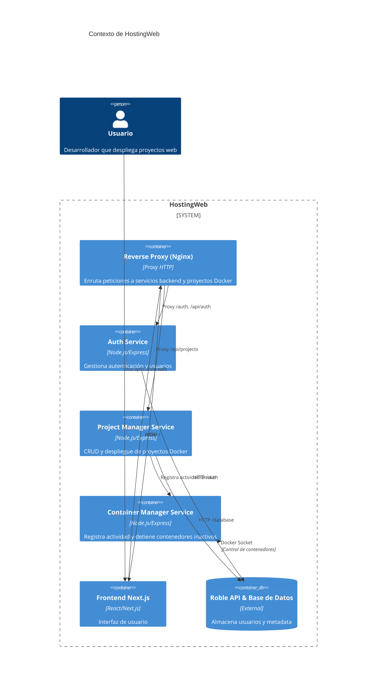
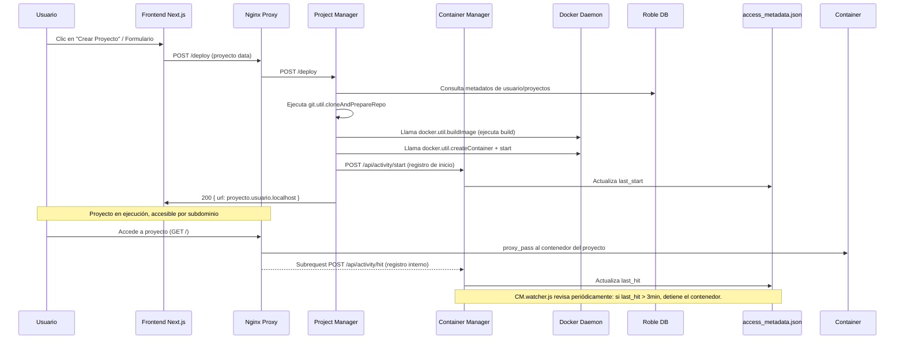

<div align="center">

# Plataforma de Despliegue Automatizado con Docker

[](https://nodejs.org/)
[](https://expressjs.com/)
[](https://roble.uninorte.edu.co/)
[](https://nextjs.org/)
[](https://react.dev/)
[](https://www.typescriptlang.org/)
[](https://developer.mozilla.org/docs/Web/JavaScript)
[](https://tailwindcss.com/)
[](https://shadcn-ui.com/)
[](https://www.docker.com/)
[](https://traefik.io/)
[](https://jwt.io/)
[](https://opensource.org/licenses/MIT)


Plataforma web dinámica para crear, desplegar, monitorear y gestionar proyectos en contenedores Docker, con autenticación por tokens, auto-apagado por inactividad y visualización de recursos en tiempo real.

[Descripción del Proyecto](#-descripción-del-proyecto) • 
[Características](#-características) • 
[Arquitectura](#️-arquitectura) • 
[Tecnologías](#️-tecnologías) • 
[Requisitos Previos](#-requisitos-previos) • 
[Instalación y Configuración](#%EF%B8%8F-instalación-y-configuración) • 
[Uso](#-uso) • 
[Repositorios de Templates](#-repositorios-de-templates-dockerizados) • 
[Demostración](#-video-de-demostración) • 
[Flujo del Sistema](#-flujo-de-trabajo-del-sistema) • 
[Seguridad](#-estrategia-de-seguridad) • 
[Optimización de Recursos](#%EF%B8%8F-optimización-de-recursos) • 
[Estructura del Proyecto](#-estructura-del-proyecto) • 
[Endpoints](#-endpoints-de-la-api) • 
[Autores](#-autores) • 
[Licencia](#-licencia)

</div>

## 📝 Descripción del Proyecto

Esta plataforma es un sistema web completo diseñado para **crear, desplegar, gestionar y monitorear proyectos dentro de contenedores Docker** de forma automática, segura y escalable. Su objetivo principal es permitir que cualquier usuario despliegue aplicaciones basadas en plantillas preconfiguradas sin necesidad de instalar Docker localmente ni realizar configuraciones manuales.

El sistema está compuesto por:

- **Frontend interactivo** construido con Next.js, React, TypeScript, TailwindCSS y Shadcn/UI.  
- **Backend robusto** basado en Node.js y Express.js, encargado de la autenticación, gestión de proyectos y comunicación directa con Docker Engine.  
- **Módulo automatizado de despliegue**, que clona repositorios, construye imágenes, crea contenedores y gestiona puertos automáticamente.  
- **Integración con Roble**, permitiendo registrar proyectos, validar usuarios y mantener trazabilidad de cada despliegue.  
- **Monitoreo en tiempo real**, mostrando métricas de uso de CPU y RAM por contenedor.  
- **Apagado automático por inactividad**, lo que optimiza recursos del servidor y evita sobrecargas.

La plataforma permite a los usuarios:

- Crear proyectos en segundos  
- Desplegar aplicaciones con un solo clic  
- Consultar el estado real del contenedor  
- Visualizar métricas de rendimiento  
- Iniciar, detener o re-desplegar contenedores  
- Reducir su impacto en el servidor mediante apagado inteligente  

Todo desde una interfaz web moderna, responsiva y orientada a la experiencia del usuario.

## 🧩 Características

La plataforma ofrece un conjunto completo de funcionalidades para gestionar microservicios en contenedores Docker de forma automática y segura:

### 🚀 Gestión Automática de Proyectos
- Creación de proyectos a partir de plantillas preconfiguradas (HTML, React, Flask, Node, etc.).
- Clonado automático del repositorio desde GitHub.
- Despliegue inmediato en un contenedor Docker aislado.

### 🐳 Administración Inteligente de Contenedores
- Construcción automática de imágenes Docker.
- Inicio, detención y re-despliegue desde la interfaz web.
- Eliminación completa de proyectos (contenedor + imagen + registro en Roble).

### 📊 Monitoreo en Tiempo Real
- Lectura directa de métricas desde Docker Engine.
- Visualización del uso de CPU (%) en tiempo real.
- Visualización del uso de RAM (MB), con barra de progreso.
- Estado real del contenedor: `running`, `stopped`, `not_found`.

### ⚡ Optimización y Ahorro de Recursos
- Sistema de auto-apagado por inactividad.
- Registro y seguimiento del último acceso del usuario.
- Limpieza automática de archivos temporales luego de cada despliegue.

### 🔒 Seguridad Integrada
- Autenticación mediante tokens (access + refresh).
- Validación de usuario a través del servicio Roble Auth.
- Restricción de endpoints mediante middleware seguro.
- Rate limiting por usuario para evitar abuso del sistema.

### 🌐 Panel Web Moderno
- Interfaz construida con Next.js, React y Shadcn/UI.
- Dashboard con estado de proyectos y métricas.
- Vista detallada por proyecto, con acciones rápidas.
- Experiencia responsiva y optimizada para navegadores modernos.

### 🔗 Integración con Roble
- Registro de proyectos por usuario.
- Obtención centralizada de datos mediante API.
- Actualización automática del token al desplegar.

### 🧱 Plantillas Dockerizadas
- Repositorios independientes listos para uso.
- Plantillas estandarizadas y listas para producción.
- Cada microservicio corre en su propio contenedor aislado.


## 🏗️ Arquitectura

### 🌐 Contexto de HostingWeb (C4 Context)

El proyecto está compuesto por **cuatro contenedores principales** y la **aplicación frontend**, interactuando con una base de datos externa.



### 🧱 Componentes Principales

| Componente | Tecnología Clave | Función Principal |
| :--- | :--- | :--- |
| **Reverse Proxy (Nginx)** | Proxy HTTP | Punto de entrada. Enruta peticiones a servicios, frontend o contenedores de proyectos (incluye lógica de *wakeup* y registro de *hits*). |
| **Auth Service** | Node.js/Express | Gestión de **autenticación**, registro y validación/refresh de tokens de sesión. |
| **Project Manager Service** | Node.js/Express | **CRUD** de proyectos, **despliegue** (clonar, construir, arrancar Docker) y monitoreo. |
| **Container Manager Service** | Node.js/Express | Registra **actividad** (`last_hit`, `last_start`) y detiene contenedores inactivos tras **3 minutos**. |
| **Frontend Next.js** | React/Next.js | Interfaz de usuario para desarrolladores (gestión de proyectos, despliegue, edición). |
| **Roble API & Base de Datos** | External | Almacena usuarios, tokens y metadatos de los proyectos. |

### ⚙️ Servicios Backend

#### 🔐 Auth Service (`backend/auth-service`)

Servicio dedicado a la gestión de **autenticación** y **tokens**. Expone el puerto **3000**.

| Archivo/Componente | Descripción Clave |
| :--- | :--- |
| **`auth.controller.js`** | Lógica de negocio para: validación, llamadas a Roble API (login, signup, refresh, logout) y *middlewares* de extracción de metadatos. |
| **`index.js`** | Configura Express y define los *endpoints* de la API (p.ej., `/login`, `/signup-direct`, `/refresh-token`, `/verify-token`). |

> 🌐 **Ejemplo de Endpoint: Login**
> Método: `POST` | Endpoint: `/login`
> Retorna: `{"accessToken": "...", "refreshToken": "...", "user": {...}}` (200 OK)

#### 📦 Project Manager Service (`backend/project-manager-service`)

Encargado del **CRUD de proyectos** y del ciclo de **despliegue** y **control** de contenedores. Expone el puerto **3001**.

| Archivo/Componente | Función Principal |
| :--- | :--- |
| **`auth.middleware.js`** | Verifica la validez del token de usuario ante el **Auth Service**. |
| **`git.util.js`** | Utiliza `simple-git` para clonar repositorios. |
| **`docker.util.js`** | Implementa las operaciones de **construcción de imágenes** y **creación/manipulación de contenedores** con `dockerode`. |
| **`project.controller.js`** | Lógica central: `createAndDeployProject`, *CRUD* de proyectos, y control de estado (`stopProject`, `startProject`). |
| **`index.js`** | Define rutas protegidas (ej: `/deploy`, `/projects`, `/projects/:projectId/*`) con un *rate limiter*. |

> 🌐 **Ejemplo de Endpoint: Listar Proyectos**
> Método: `GET` | Endpoint: `/projects`
> Autorización: Header `Authorization: Bearer <accessToken>`

#### 🚦 Container Manager Service (`backend/container-manager-service`)

Gestiona el **registro de actividad** y el **mantenimiento** de la inactividad. Expone el puerto **3002**.

| Archivo/Componente | Detalle de la Operación |
| :--- | :--- |
| **`watcher.js`** | Proceso que **cada 30s** revisa contenedores. Detiene aquellos inactivos por **3 minutos**. |
| **`index.js`** | Endpoints de registro: `/api/activity/hit` (último acceso) y `/api/activity/start` (último arranque). |

> 🌐 **Ejemplo de Endpoint: Registrar HIT**
> Método: `POST` | Endpoint: `/api/activity/hit`
> Cuerpo: `{"containerName": "mi-app.usuario"}`

#### 🔄 Nginx Proxy (`backend/nginx-proxy`)

Punto de entrada HTTP y responsable del **enrutamiento** y **subdominios de proyecto**. Expone el puerto **80**.

| Archivo/Configuración | Función Principal |
| :--- | :--- |
| **`Dockerfile`** | Basado en `nginx:stable-alpine`. |
| **`nginx.conf`** | Configuración detallada: **Rate Limiting**, **Mapeo** de *hostnames* a contenedores, y **Rutas estáticas** a los servicios backend y al Frontend. Implementa **Subrequest** para registrar actividad en el Container Manager. |

### 🎨 Frontend (`frontend`)

Aplicación construida con **Next.js** que consume las APIs del backend y ofrece la interfaz de usuario.

#### 🧩 Configuración y Estructura

* **`Dockerfile`**: *Build* y *Runner* en etapas separadas.
* **`app/`**: Directorio de rutas de Next.js.

#### 🧭 Estructura de Rutas

* `home/page.tsx`: **Listado de proyectos** y formulario de configuración inicial.
* `projects/new/page.tsx`: *Wizard* para la **creación de nuevos proyectos**.
* `projects/[id]/page.tsx`: **Vista detalle** (estado, estadísticas, logs).

#### 💻 Componentes UI Atómicos (`components/ui/`)

Utiliza **componentes atómicos** basados en primitivas de **Radix UI** y estilizados con **Tailwind CSS**.

| Categoría | Ejemplos de Componentes |
| :--- | :--- |
| **Formularios** | `input.tsx`, `textarea.tsx`, `checkbox.tsx` |
| **Feedback** | `dialog.tsx`, `alert-dialog.tsx`, `use-toast.ts` |
| **Estructura** | `card.tsx`, `sidebar.tsx`, `navigation-menu.tsx` |

### 🔁 Flujo de Despliegue y Mantenimiento

Este diagrama ilustra la secuencia de eventos cuando un usuario **despliega un nuevo proyecto** y el subsiguiente **registro de actividad** (HIT).


[Image of the Sequence Diagram for Project Deployment Flow]





## 🛠️ Tecnologías

La plataforma está construida utilizando un ecosistema moderno de herramientas y frameworks que permiten ofrecer un sistema robusto, seguro y altamente automatizado.

### 🖥️ Frontend
- **Next.js** — Framework React para SSR/SSG.
- **React** — Librería principal para interfaces dinámicas.
- **TypeScript** — Tipado estático para mayor robustez.
- **TailwindCSS** — Estilos utilitarios rápidos y optimizados.
- **Shadcn/UI** — Componentes modernos y accesibles.
- **Vite** (para templates React) — Bundler ultrarrápido.

### ⚙️ Backend
- **Node.js** — Entorno de ejecución.
- **Express.js** — Framework para API REST.
- **Axios** — Cliente HTTP para integraciones con Roble Auth.
- **Dockerode** — Gestión de Docker Engine desde Node.
- **fs-extra / tar-fs** — Utilidades para manejo de archivos.

### 🐳 Contenerización y Orquestación
- **Docker Engine** — Construcción, despliegue y ejecución de contenedores.
- **Docker CLI/Dockerode** — Comunicación directa para métricas, estado y control de recursos.

### 🔐 Autenticación y Seguridad
- **Roble Auth Service** — Validación de usuario, generación de tokens y manejo de refresh tokens.
- **Middleware de seguridad** — Protección de rutas y verificación de tokens.
- **Rate Limiting** — Control de peticiones por usuario.

### 🔗 Integración con Servicios Roble
- Registro de proyectos.
- Consultas seguras vía token.
- Almacenamiento centralizado de despliegues.

### 🧪 Desarrollo y Utilidades
- **Git & GitHub** — Control de versiones y templates.
- **ESLint / Prettier** — Estándares de código limpio.
- **Postman / Thunder Client** — Pruebas de API.

## 📌 Requisitos Previos

Antes de ejecutar la plataforma, asegúrate de contar con:

### 🐳 Contenerización
- Docker Engine 20.10 o superior.

### 🖥️ Dependencias del Sistema (sin docker)
- Node.js 18+  
- Git  
- Sistema operativo: Linux (recomendado), macOS o Windows con WSL2.

## ⚙️ Instalación y Configuración

A continuación se muestra la forma recomendada de levantar toda la plataforma usando **Docker y Docker Compose**, sin necesidad de instalar Node.js ni dependencias manuales.

### 1️⃣ Clonar el repositorio principal
```bash
git clone https://github.com/zoviedo/proyecto-hosting.git
```

### 2️⃣ Crear el archivo `.env` del backend
Dentro de la carpeta `/backend`, crea un archivo llamado `.env`:

```
PORT=3001
ROBLE_PROJECT_CONTRACT=proyectohosting_de7f72c4e7
PROJECTS_TABLE_NAME=proyectos_hosting
```

### 3️⃣ Levantar toda la plataforma con un solo comando
```bash
docker compose up --build -d
```

### 4️⃣ Verificar que todo esté corriendo
```bash
docker ps
```

Debes ver contenedores para:
- frontend
- roble-auth-service
- roble-project-manager
- roble-reverse-proxy
- roble-container-manager

### 5️⃣ Acceder a la plataforma
```bash
http://localhost
```

### 6️⃣ Detener la plataforma
```bash
docker compose down
```

## 🚀 Uso

La plataforma permite crear, desplegar y administrar proyectos en contenedores Docker de manera automática. A continuación se describe el flujo básico de uso.

### 1️⃣ Crear una cuenta e iniciar sesión
1. Ingresa a la plataforma.
2. Regístrate con nombre, correo y contraseña.
3. Inicia sesión para acceder al panel principal.


### 2️⃣ Usar o modificar las plantillas oficiales
Antes de crear un proyecto, puedes utilizar cualquiera de las plantillas abiertas en GitHub:

- **Flask (Python)**  
  https://github.com/UnUsuarioOfGitHub/template-flask

- **HTML / CSS / JavaScript**  
  https://github.com/vanediazdelahoz/template-html-css-js

- **React + Vite (JavaScript)**  
  https://github.com/zoviedo/template-react

**Puedes clonarlas, modificarlas, agregar tu propio código y luego conectar tu repositorio personalizado al momento de desplegar.**

Esto te permite iniciar rápidamente con un entorno preconfigurado y adaptarlo a tus necesidades.


### 3️⃣ Crear y desplegar un proyecto
1. En el dashboard, selecciona **Crear proyecto**.
2. Completa:
   - Nombre del proyecto  
   - Descripción  
   - Tipo de template (HTML/CSS/JS, React o Flask)  
   - URL de tu repositorio Git (puede ser una plantilla modificada)
3. La plataforma automáticamente:
   - Clona tu repositorio  
   - Construye la imagen Docker  
   - Ejecuta el contenedor  
   - Registra todo en Roble
4. El proyecto aparecerá en tu dashboard con su estado y URL pública.


### 4️⃣ Administrar un proyecto
Desde la vista del proyecto puedes:

- Ver **estado** (Activo / Detenido / No encontrado)
- Consultar **métricas en tiempo real**:
  - Uso de CPU  
  - Memoria RAM  
- Ejecutar acciones:
  - **Iniciar**
  - **Detener**
  - **Re-desplegar** (reconstruir desde Git)
  - **Eliminar**

### 5️⃣ Editar proyecto
El botón **Editar** permite modificar:

- Nombre  
- Descripción  
- Tipo de template  
- URL del repositorio

### 6️⃣ Auto-stop y auto-start
- Los contenedores se **detienen automáticamente** después de un periodo sin tráfico.
- Cuando reciben una nueva visita, la plataforma los **reanuda automáticamente**.

No es necesario administrar infraestructura manualmente.

### 7️⃣ Cerrar sesión
Puedes cerrar sesión en cualquier momento desde el menú superior.


## 📂 Repositorios de Templates Dockerizados

La plataforma utiliza plantillas preconfiguradas que permiten desplegar aplicaciones rápidamente dentro de contenedores Docker. Cada template incluye su propio `Dockerfile`, estructura estándar y configuración lista para producción.

### 🔧 Templates Disponibles

- **Flask (Python)**  
  https://github.com/UnUsuarioOfGitHub/template-flask

- **HTML / CSS / JavaScript**  
  https://github.com/vanediazdelahoz/template-html-css-js

- **React + Vite (JavaScript)**  
  https://github.com/zoviedo/template-react

### 📌 Características Comunes
- Dockerfile optimizado para despliegues rápidos.  
- Scripts de build y configuración de puertos expuestos.  
- Organización estándar de archivos para facilitar modificaciones.  
- Compatibilidad total con la plataforma de microservicios.  

## 🎥 Video de Demostración

A continuación se muestra un video que ilustra el funcionamiento de la plataforma:

<p align="center">
  <a href="https://www.youtube.com/watch?v=Yoe7kQKmtVE" target="_blank">
    
  </a>
</p>

## 🧭 Flujo de Trabajo del Sistema

El sistema sigue un flujo automatizado que permite al usuario crear, desplegar, ejecutar y administrar microservicios sin interactuar directamente con Docker o servidores. El proceso completo funciona así:


### 1️⃣ Autenticación del Usuario
1. El usuario inicia sesión o se registra.
2. El **Auth Service** genera un *access token* y *refresh token*.
3. Todo acceso al sistema pasa por validación de token mediante middleware.

### 2️⃣ Creación del Proyecto
1. El usuario elige un template o usa su propio repositorio Git.
2. Envía los datos a `POST /deploy`, incluyendo:
   - nombre del proyecto  
   - descripción  
   - URL del repositorio  
   - tipo de plantilla  
3. El **Project Manager Service**:
   - clona el repo
   - prepara los archivos
   - construye una imagen Docker
   - levanta el contenedor asignándole nombre único
   - registra el proyecto en Roble

### 3️⃣ Ejecución del Contenedor
1. El contenedor queda accesible mediante subdominios internos (`<project>.<user>.localhost`).
2. Traefik enruta automáticamente cada proyecto según sus labels.
3. El Container Manager actualiza el mapa de actividad e inicia el contador de inactividad.

### 4️⃣ Gestión del Proyecto desde el Dashboard
El usuario puede:
- iniciar / detener el contenedor  
- ver métricas de CPU y RAM  
- re-desplegar (actualiza la imagen desde Git)  
- editar información del proyecto  
- eliminar el contenedor + imagen + registro  
Todo mediante acciones que llaman a los endpoints del Project Manager.

### 5️⃣ Auto-Stop por Inactividad
1. El Container Manager revisa actividad cada 60 segundos.
2. Si un contenedor supera el tiempo configurado sin tráfico:
   - se detiene automáticamente  
   - se actualiza el estado en el dashboard  

### 6️⃣ Auto-Start al Recibir Tráfico
1. Traefik recibe una solicitud hacia un proyecto detenido.
2. Llama automáticamente a `/wakeup/:containerName`.
3. El contenedor se inicia instantáneamente.
4. El usuario accede sin notar la pausa.

### 7️⃣ Registro de Actividad
Cada visita real a un proyecto llama a:

```
POST /hit/:containerName
```
Lo que:
- actualiza la última actividad  
- reinicia el contador de auto-stop  

Este flujo garantiza una plataforma eficiente, escalable y con uso óptimo de recursos.


## 🔐 Estrategia de Seguridad

La seguridad de la plataforma se construye sobre tres pilares fundamentales:  
**aislamiento del entorno de ejecución**, **gestión centralizada de identidad** y **minimización de datos sensibles**.  
Esta estrategia reduce el riesgo de ataques, asegura el control de acceso y garantiza que cada componente funcione de manera independiente y segura.


### 1️⃣ Aislamiento y Microservicios (Arquitectura Modular)

La plataforma utiliza **Docker** y **Docker Compose** para garantizar que cada servicio se ejecute en un entorno completamente aislado. Esto significa que un fallo o vulnerabilidad en un componente no compromete todo el sistema.

#### ✔ Aislamiento por componentes  
Los servicios están separados en microservicios independientes:

- **Project Manager Service**  
- **Container Manager Service**  
- **Auth Service**  
- **Reverse Proxy**  

Cada uno tiene una única responsabilidad.  
Un incidente en un servicio no afecta la seguridad de los otros.

#### ✔ Aislamiento de contenedores de usuario  
Cada proyecto desplegado se ejecuta en un **contenedor Docker dedicado**, evitando:

- Acceso no autorizado al sistema de archivos del servidor  
- Acceso entre proyectos de distintos usuarios  
- Conflictos entre entornos o dependencias  


### 2️⃣ Gestión de Identidad y Acceso (IAM)

La plataforma delega autenticación y autorización al servicio institucional de **Roble**, garantizando control centralizado y seguridad lógica.

#### ✔ Autenticación Roble  
Todos los usuarios deben autenticarse con cuentas institucionales registradas en Roble.  
Esto evita identidades falsas o externas.

#### ✔ Tokens JWT (Access Token + Refresh Token)
- El **Access Token** permite verificar identidad sin necesidad de reenviar credenciales.  
- El **Refresh Token** mantiene sesiones seguras sin obligar al usuario a iniciar sesión repetidamente.

#### ✔ Cierre de sesión seguro  
El logout llama directamente al endpoint oficial de Roble, invalidando el Access Token de forma inmediata.

Incluso si el token es interceptado, **deja de ser válido** después del cierre de sesión.


### 3️⃣ Minimización de Datos y Entorno Seguro

La plataforma aplica principios de **privacy-by-design** minimizando la cantidad de información sensible almacenada.

#### ✔ Datos mínimos almacenados  
Solo se guarda en Roble:

- `id_usuario`  
- `username`  

No se almacenan:
- correos electrónicos  
- contraseñas  
- credenciales sensibles  

#### ✔ Gestión segura de secretos (`.env`)  
Los archivos `.env` contienen:

- `ROBLE_PROJECT_CONTRACT` (clave obligatoria para la API de Roble)  
- nombres de tablas del proyecto (ej. `proyectos_hosting`, `user_metadata`)  
- tokens y endpoints privados  

Estos archivos:

- no se suben al repositorio  
- están protegidos mediante `.gitignore`  
- se inyectan como variables de entorno en Docker al levantar los servicios  

Esto evita fugas de información sensible en GitHub.


### 4️⃣ Protección contra Sobrecarga (Rate Limiting)

La infraestructura está protegida contra abusos y ataques de denegación de servicio mediante un sistema de limitación de peticiones.

#### ✔ Rate Limit en el Reverse Proxy (Nginx)  
El proxy aplica:

```nginx
limit_req_zone $binary_remote_addr zone=host_limit:10m rate=60r/m;
```
Esto controla cuántas solicitudes por minuto puede hacer cada IP.

#### ✔ Control de flujo
En la configuración:

```nginx
limit_req zone=host_limit burst=20 nodelay;
```
- Permite hasta 20 solicitudes extra antes de empezar a rechazar
- Evita que la sobrecarga llegue al backend
- Protege los microservicios de saturación accidental o maliciosa

Esta estrategia combinada asegura que la plataforma sea robusta, segura, aislada y resistente a ataques de carga.

## ♻️ Optimización de Recursos

La plataforma implementa un modelo híbrido de optimización basado en:  
1) **restricciones de hardware por contenedor**, y  
2) **apagado/encendido automático por inactividad**.  

Esto garantiza que múltiples proyectos puedan coexistir sin comprometer la estabilidad del sistema.

### 1️⃣ Restricciones de CPU y Memoria (Límites Duros)

Cada contenedor de usuario se ejecuta con recursos controlados para evitar saturar el servidor.

#### ✔ Asignación de recursos por contenedor
```js
HostConfig: {
  Memory: 512 * 1024 * 1024,   // 512 MB (536870912 bytes)
  NanoCpus: 500000000          // 0.5 CPU
}
```

#### ✔ Propósito y beneficios
- Prevención de abuso accidental o malicioso.  
- Estabilidad del servidor: los contenedores nunca exceden 512 MB RAM ni 0.5 CPU.  
- Aislamiento total entre proyectos y microservicios críticos.  
- Rendimiento predecible en ambientes compartidos.  

### 2️⃣ Gestión de Inactividad (Apagado y Encendido Automático)

La plataforma incorpora un sistema avanzado de **auto-stop** y **auto-start**, diseñado para ahorrar recursos y reactivar proyectos solo cuando son utilizados.

Implementado en:
- Container Manager Service (`watcher.js`)
- Project Manager Service (`project.controller.js`)
- Reverse Proxy (Nginx)


### 📊 Tabla Completa: Optimización de Recursos (Auto-Stop / Auto-Start)

| Funcionalidad                  | Componente                              | Lógica Implementada |
|-------------------------------|------------------------------------------|----------------------|
| **Apagado Automático**        | Watcher Service                          | Un proceso periódico calcula la **Última Actividad** (`lastActiveTime = Math.max(last_hit, last_start)`). Si supera **3 minutos en pruebas** o **30 minutos en producción**, se ejecuta `docker stop`, liberando recursos. |
| **Registro de Actividad (Hit)** | Reverse Proxy (Nginx) & Project Manager | Nginx dispara una sub-petición a `/hit` mediante `X-Accel-Redirect` con cada acceso al proyecto. Esto actualiza `last_hit`, reiniciando el contador de inactividad. |
| **Auto-Encendido**            | Reverse Proxy (Nginx) & Project Manager | Si un proyecto detenido recibe tráfico (502/504), Nginx redirige a `@wakeup`, el Project Manager ejecuta `docker start` y devuelve al usuario al sitio una vez activo. |
| **Visualización de Inactividad** | Project Manager & Frontend             | Se combinan `last_hit` y `last_start` para calcular `último_acceso`, expuesto al frontend para mostrar al usuario el estado real de su proyecto. |


### 3️⃣ Beneficios de la Optimización Dinámica

- Ahorro significativo de RAM y CPU.  
- Escalabilidad: permite alojar muchos proyectos con recursos limitados.  
- Experiencia fluida gracias al encendido bajo demanda.  
- Protección contra abuso o errores del usuario.  


## 🧬 Estructura del Proyecto

La plataforma está organizada en dos capas principales: backend (microservicios) y frontend (interfaz Next.js).
A continuación se presenta la estructura general del repositorio:

```
proyecto-hosting/
│
├── backend/
│   ├── auth-service/                 # Servicio de autenticación (tokens, refresh, login)
│   ├── container-manager-service/    # Gestiona containers Docker: creación, stats, auto-stop
│   ├── nginx-proxy/                  # Reverse proxy (Traefik / Nginx)
│   └── project-manager-service/      # Orquestador de despliegues y registro en Roble
│
├── frontend/
│   ├── app/
│   │   ├── home/                     # Dashboard principal del usuario
│   │   ├── login/                    # Vista de inicio de sesión
│   │   ├── signup/                   # Registro de usuario
│   │   └── projects/                 # CRUD de proyectos (detalle, editar, stats)
│   │
│   ├── components/                   # Componentes UI reutilizables (Shadcn/UI)
│   ├── lib/                          # Utilidades y helpers
│   ├── public/                       # Imágenes, assets estáticos
│   ├── styles/                       # Estilos globales y configuraciones de Tailwind
│   │
│   ├── Dockerfile                    # Dockerfile del frontend
│   ├── next.config.mjs               # Configuración de Next.js
│   ├── package.json                  # Dependencias del proyecto
│   ├── tsconfig.json                 # Configuración de TypeScript
│   └── .env                          # Variables de entorno del frontend
│
├── docker-compose.yml                # Orquestación completa de todos los servicios
├── README.md                         # Documentación principal
└── .gitignore                        # Archivos ignorados por Git

```

## 🔌 Endpoints de la API

A continuación, se presenta una referencia de todos los endpoints disponibles para interactuar con la plataforma de gestión de proyectos.

Estos recursos HTTP permiten la autenticación, el despliegue y la administración completa de los contenedores de tus proyectos, incluyendo control de estado, eliminación y consulta de métricas.

| Categoría | Descripción | Método HTTP | Ruta/URL | Notas Importantes |
| :--- | :--- | :--- | :--- | :--- |
| Autenticación | Encabezado requerido para acceder a las rutas protegidas. | N/A | N/A | `Authorization: Bearer <accessToken>` |
| Operación | Despertar un contenedor (Auto-arranque). | `GET` | `/wakeup/:containerName` | Inicia un contenedor previamente en "suspensión". |
| Operación | Crear y Desplegar un nuevo proyecto. | `POST` | `/deploy` | Permite la creación y el despliegue inicial. |
| Operación | Listar todos los proyectos del usuario. | `GET` | `/projects` | |
| Operación | Obtener los Detalles de un proyecto específico. | `GET` | `/projects/:projectId` | Requiere el ID único del proyecto. |
| Operación | Actualizar un proyecto existente. | `PUT` | `/projects/:projectId` | Utilizado para modificar la configuración del proyecto. |
| Operación | Eliminar un proyecto. | `DELETE` | `/projects/:projectId` | Elimina permanentemente el proyecto y su contenedor. |
| Control Contenedor | Detener el contenedor de un proyecto. | `POST` | `/projects/:projectId/stop` | |
| Control Contenedor | Iniciar el contenedor de un proyecto. | `POST` | `/projects/:projectId/start` | |
| Control Contenedor | Re-desplegar (reiniciar con nueva versión) el proyecto. | `POST` | `/projects/:projectId/redeploy` | |
| Métricas | Obtener las Métricas de rendimiento del contenedor. | `GET` | `/projects/:projectId/stats` | |
| Tráfico | Registrar tráfico (para auto-stop/suspensión). | `POST` | `/hit/:containerName` | Usado para mantener el contenedor activo. |
| Restricción | Límite de Tasa (Rate Limiting). | N/A | N/A | Muestra mensaje de error si se excede el límite. |
| Seguridad | Configuración CORS. | N/A | N/A | Permite peticiones desde cualquier origen (`*`). |

## 👥 Autores

<div align="center">

<strong>Zharick Oviedo</strong> · <a href="https://github.com/zoviedo">@zoviedo</a>  
<strong>Vanessa Díaz</strong> · <a href="https://github.com/vanediazdelahoz">@vanediazdelahoz</a>  
<strong>Juan Romero</strong> · <a href="https://github.com/UnUsuarioOfGitHub">@UnUsuarioOfGitHub</a>

</div>

## 📜 Licencia

Este proyecto está bajo la licencia **MIT**.  
Esto significa que puedes usar, copiar, modificar, fusionar, publicar, distribuir, sublicenciar y/o vender copias del software, siempre y cuando incluyas el aviso de copyright original y la licencia en todas las copias o partes sustanciales del software.

Para más detalles, consulta la licencia completa aquí:  
[MIT License](https://opensource.org/licenses/MIT)